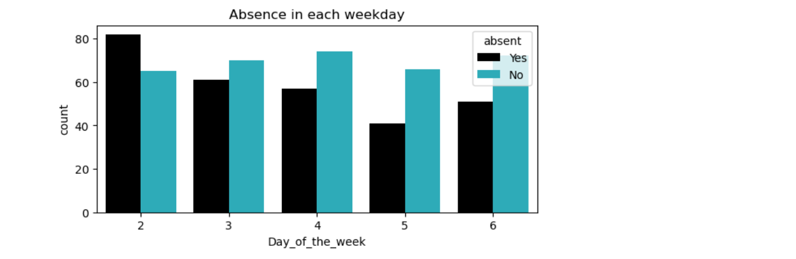
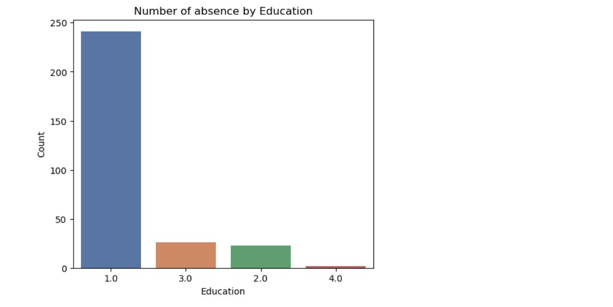
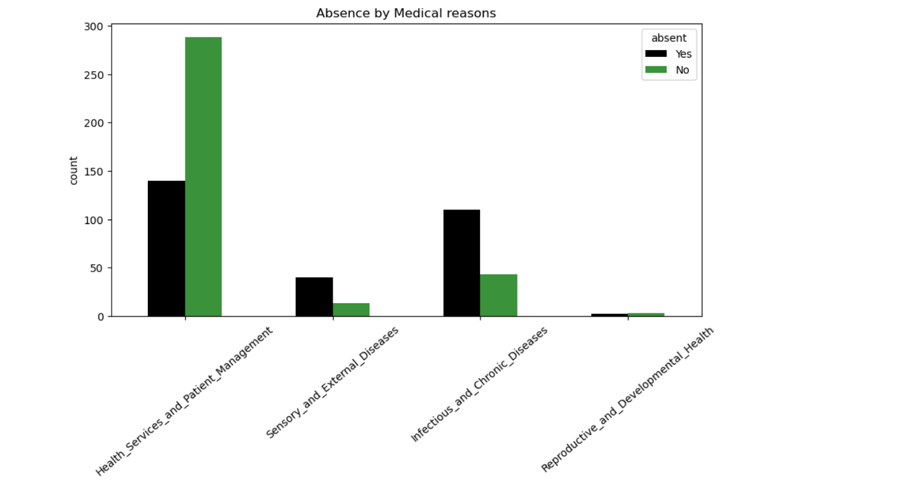
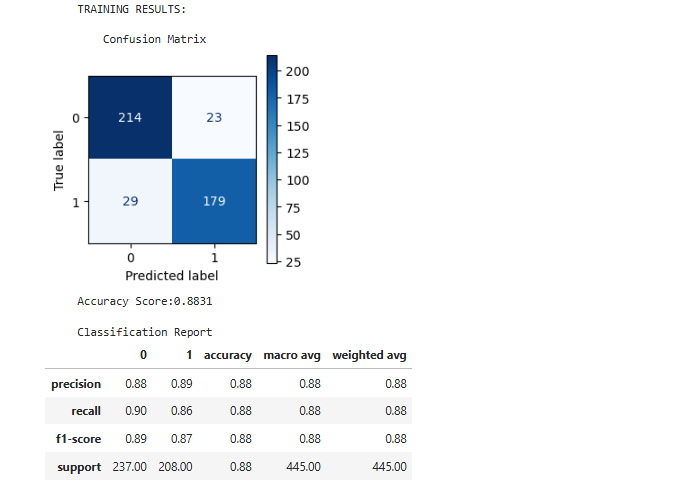
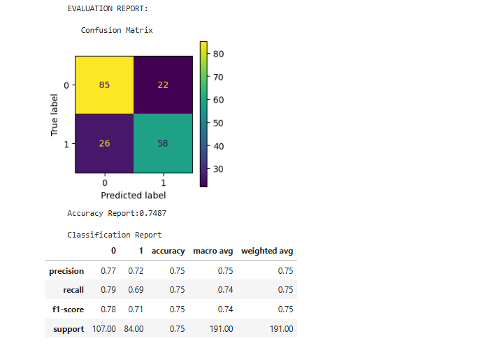
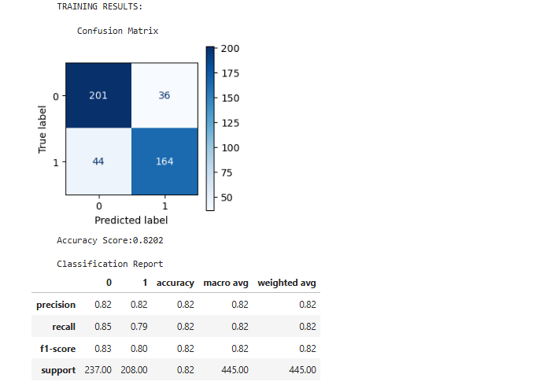
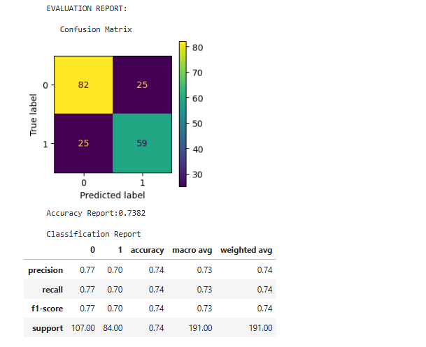
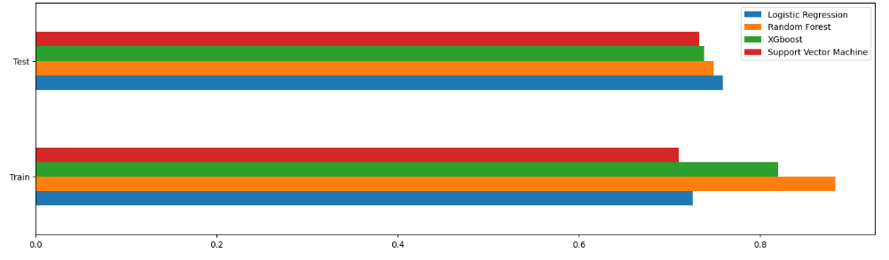

# Berkeley AI/ML Capstone Project: Employee Absenteeism at Work
<br>
Professional Certificate in Machine Learning &Artificial Intelligence
Berkeley Engineering, Berkeley Hass

**Author**
Shajen Muttath

### Business case
In todays environment of workplace is extremely competitive and leads to increased stress and health issues. This project analyse relationships of workplace absenteeism and various factors. In this project absenteeism is defined as absence from work at normal hours.

#### Dataset
The dataset was obtained from Kaggle [absenteeismDataset](https://www.kaggle.com/code/faressayah/predict-employee-absenteeism-from-work/input)

```
The dataset have following fields:
ID                                   int64
Reason_for_absence                 float64
Month_of_absence                   float64
Day_of_the_week                      int64
Seasons                              int64
Transportation_expense             float64
Distance_from_Residence_to_Work    float64
Service_time                       float64
Age                                float64
Work_load_Average_per_day          float64
Hit_target                         float64
Disciplinary_failure               float64
Education                          float64
Children                           float64
Social_drinker                     float64
Social_smoker                      float64
Pet                                float64
Weight                             float64
Height                             float64
Body_mass_index                    float64
Absenteeism_time_in_hours          float64
```

## Exploratory Data Analysis
In this EDA, each feature is analysed to find out their relation with the absenteeism.

#### Feature : Absenteeism_time_in_hours
This feature represents number of hours employee has taken off during the work day.
The histogram below shows how many hours people take absence. 
<br>
<br>
75% of them taken 8 hours. Median is 3 hours. Lets use absent or not as target feature. For this we can define hours taken above median as absent. Otherwise not absent.

<br>
#### Feature : ID
In the bar chartbelow, we are looking at the counts of all employees absences. We can see that the employee with ID 3, 11 and 20 have the most absences, with an absence count arround 30 times. We also see that the employee with ID 32 has the least amount of absences, with an absence count close to 0. Most of the employees have taken absennce 5 to 15 times.

The feature ID do not have a effect in emlpoyee absence. So ID needs to be removed from training.
<br>

<br>
#### Feature :  Month_of_absence
In the bar chart below, we see that most employees are absent from work during the month of July with more than 50 recorded absences. The least amount of absences occur in January with less than 15 absences. Months May, June, August, October and November has almost same number of absences of 25 times. There seems to be no significance in the distribution of absences across the months.
<br>
<br>

<br>

#### Feature : Seasons
The 4 seasons are 1-Spring, 2-Summer, 3-Fall, 4-Winter. Most people were absent in fall and spring. In fall, there are eqaual number of people not absent as well. Lowest absence is in summer.
<br>
<br>

<br>

<br>

#### Feature : Day_of_the_week
The day of weeks are 1-Sunday, 2-Monday, 3-Tuesday, 4-Wednesday, 5-Thursday, 6-Friday, 7-Saturday. Most number of absence is noted on Monday and least on Thursday. There seems to have a relation with day of week on absence.
<br>
<br>

<br>

<br>

#### Feature : Age
The absence happened in all age groups. Within absent people, age 30 and 28 have highest absence. The younger age group were more absent than old age group
<br>

<br>

<br>

#### Feature : Social_drinker
In the bar chart, groups are 0.0-Not Social Drinker, 1.0-Social Driker. There is more absense in Social Drinking group. Social drinking has some effect on being absent
<br>


<br>
<br>

#### Feature : Social_smoker
In the bar chart the groups are 0.0-Not a Social Smoker, 1.0-Social Smoker. The absence is more among non-smocking group, which make sence as there is less smoking people at workplace.
<br>

<br>
<br>

#### Feature : Education
The education groups are 1 High school, 2 Graduate, 3 Postgraduate, 4 Masters. Highest absence can be seen in group with highschool education. Lowest absence found in people with Masters degree. Educated people seems to be less absent at workplace.
<br>

<br>
<br>

<br>
<br>

#### Feature : Children
Within absentees, no children group have highest absence. People with more children seems to be less absent at workplace.
<br>

<br>


<br>
<br>

#### Feature : Pet
Within absentees, no pets group have highest absence. People with more pets seems to be less absent at workplace.
<br>

<br>

<br>
<br>

#### Feature : Body_mass_index
Wihin absentees, people with body mass index 25 being more absent. The absenteeism is visible in all body mass indices.
<br>

<br>

<br>

<br>
<br>

#### Feature : Weight
People with weights 70 and 90kg were more absent than others. Being absent or not seems to be equaly distributed in all weight groups
<br>

<br>
<br>

#### Feature : Height
Within absentees, people having height 172 cm being more absent. Being absent or not is equally distributed in all heights. The height of a person should not affect being absent and this column needs to be dropped.
<br>

<br>

<br>
<br>

#### Feature : Distance_from_Residence_to_Work
The distance work has less relationship with absenteeism. People are absent regardless of distance from work.
<br>

<br>

<br>
<br>

#### Feature : Transportation_expense
Transportation expense seems to have less effect on being absent. But this feature is an importatnt factor compared to others.
<br>

<br>

<br>
<br>

#### Feature : Work_load_Average_per_day
The workload is equaly distributed among absentees and non absentees.
<br>

<br>

<br>
<br>

#### Feature : Hit_target
The hit target has no perticular relationship with absence. So this feature needs to be dropped.
<br>

<br>

<br>
<br>

#### Feature : Reason for absence
The "Reason for absence" is International Code of Diseases (ICD). The codes are:
```
•	0: 'Unknown',
•	1: 'Certain infectious and parasitic diseases',
•	2: 'Neoplasms',
•	3: 'Diseases of the blood and blood-forming organs and certain disorders involving the immune mechanism',
•	4: 'Endocrine, nutritional and metabolic diseases',
•	5: 'Mental and behavioural disorders',
•	6: 'Diseases of the nervous system',
•	7: 'Diseases of the eye and adnexa',
•	8: 'Diseases of the ear and mastoid process',
•	9: 'Diseases of the circulatory system',
•	10: 'Diseases of the respiratory system',
•	11: 'Diseases of the digestive system',
•	12: 'Diseases of the skin and subcutaneous tissue',
•	13: 'Diseases of the musculoskeletal system and connective tissue',
•	14: 'Diseases of the genitourinary system',
•	15: 'Pregnancy, childbirth and the puerperium',
•	16: 'Certain conditions originating in the perinatal period',
•	17: 'Congenital malformations, deformations and chromosomal abnormalities',
•	18: 'Symptoms, signs and abnormal clinical and laboratory findings, not elsewhere classified',
•	19: 'Injury, poisoning and certain other consequences of external causes',
•	20: 'External causes of morbidity and mortality',
•	21: 'Factors influencing health status and contact with health services',
•	22: 'Patient follow-up',
•	23: 'Medical consultation',
•	24: 'Blood donation',
•	25: 'Laboratory examination',
•	26: 'Unjustified absence',
•	27: 'Physiotherapy',
•	28: 'Dental consultation'
```
<br>

The medical codes are grouped into 4 following:

```
1 Health_Services_and_Patient_Management
2 Infectious_and_Chronic_Diseases
3 Sensory_and_External_Diseases
4 Reproductive_and_Developmental_Health
```
It seems that people are absent by spending time on medical Health Services, Patient Management process and Infecticious Chronic Diseases.
<br>

<br>
<br>

#### Correlation matrix
The heat map shows following relationships among features. First let us analyse relationship with target feature 'absent'. The 'absent' have positive effect with 'Transportation Expense', number of children, medical reason 'Infectious_and_Chronic_Diseases' and Sensory_and_External_Diseases. The 'absent' have negative effect with medical reason 'Health_Services_and_Patient_Management'. The correlation matrix also shows body related relationships between weight and age, weight and body mass index, weight and height, body mass index and age. The month of absence and seasons have a relationship.

Overall, heat map does not show any strong relation for being absent.
<br>


### Feature Engineering
Based on the above data analysis I ahve decided to drop the features ID, Height, Hit_target, Disciplinary_failure and Service_time, as they do not provide meaningfull contribution for training and some cases features like Height can be misleading. The feature 'Absenteeism_time_in_hours' is converted into  binary column 'Absent'
One Hot encoding was applied to Education and Reason_for_absence

### Modeling
Initial modeling was performed using Logistic Regression. This provided an accurracy of 0.7271. Below table gives analysis of coefficients with odds ratio.


### Summary on EDA
The exploratory analysis provided valuable information about each feature. The features Children, Transportation Expense, Seasons and medical reason 'Heath services and Patient management' are major contributors affecting the models.

<br>
<br>

## Modeling
The modeling was performed using multiple models. Following models were used:

```
    Logistic Regression
    Random Forest
    XG Boost
    Support Vector Machine
```
The dataset was standardized using **StandardScaler** and **MinMaxScaler**

### Logistic Regression
<br>
The training was done using parameter solver 'liblinear' and penalty 11

#### Training Report
The training of logistic regression model performs with an overall accuracy of 73%, correctly identifying attendance patterns in about 3/4ths of instances. For cases of no absenteeism (class 0), the model achieves a precision of 73% and recall of 76%, indicating it reliably identifies individuals who are not likely to be absent. However, for absenteeism (class 1), it shows slightly lower recall at 68% and precision at 72%, with an F1 score of 0.70, suggesting some missed absenteeism cases. Both macro and weighted average scores are around 0.72–0.73, showing balanced performance across both classes despite a minor class imbalance. While effective, the model could be improved in its ability to capture absenteeism cases with further tuning.


<br>

#### Testing Report
On the evaluation data, the logistic regression model for predicting absenteeism achieves an accuracy of 75.92%, closely aligning with the 73% seen in training performance. Precision for identifying no absenteeism (class 0) is 77%, with a recall of 82%, indicating strong performance in correctly identifying instances where absenteeism is unlikely. For cases of absenteeism (class 1), precision is 75% and recall is 68%, slightly lower than for class 0, with an F1 score of 0.71. The macro and weighted averages across precision, recall, and F1 score are each around 0.75–0.76, showing a balanced performance across classes on the evaluation set. Compared to training, the model performs slightly better on evaluation in identifying class 0 cases but maintains a consistent pattern with a minor drop in recall for absenteeism cases. This suggests the model generalizes well to new data, though improvements in capturing absenteeism (class 1) cases could further enhance its usefulness.
<br>

<br>

#### Classifier Metrics Report
For this logistic regression model classifying absenteeism, the precision-recall tradeoff graph shows how precision and recall change as the classification threshold is adjusted. The intersection point between precision and recall lines, which occurs around the midpoint, suggests a threshold where the model achieves a balance between the two metrics. In both the precision/recall graphs, recall starts high and drops sharply as precision increases, meaning that as the model becomes more precise in identifying absenteeism, it misses a higher proportion of actual absenteeism cases. This steep decline in recall indicates that the model has difficulty maintaining high recall as precision improves, suggesting a limited ability to balance both metrics well across thresholds.For absenteeism prediction, where recall (correctly identifying absenteeism cases) may be prioritized, this graph implies that a lower threshold could favor recall at the cost of some precision.

<br>


<br>

**Precision/Recall curve**
<br>
For this logistic regression model classifying absenteeism, the precision-recall tradeoff graph shows how precision and recall change as the classification threshold is adjusted. The intersection point between precision and recall lines, which occurs around the midpoint, suggests a threshold where the model achieves a balance between the two metrics. In both the precision/recall graphs, recall starts high and drops sharply as precision increases, meaning that as the model becomes more precise in identifying absenteeism, it misses a higher proportion of actual absenteeism cases. This steep decline in recall indicates that the model has difficulty maintaining high recall as precision improves, suggesting a limited ability to balance both metrics well across thresholds.For absenteeism prediction, where recall (correctly identifying absenteeism cases) may be prioritized, this graph implies that a lower threshold could favor recall at the cost of some precision.

**ROC curve**
<br>
This ROC curve illustrates the performance of the logistic regression model for classifying absenteeism, plotting the True Positive Rate (sensitivity) against the False Positive Rate across various thresholds. The curve shows a strong rise, indicating the model captures true positives effectively with low false positives at lower thresholds. The model’s ROC curve moves to the top left corner, demonstrating good discrimination ability. It deviates significantly from the diagonal line, which represents random guessing. The high area under the curve (AUC) suggests that the model effectively distinguishes between absenteeism and non-absenteeism cases and confirms that the model has solid predictive power.

**Cross validation**
<br>
The model achieved a mean cross-validation score of 70.13%, indicating a strong expected performance on unseen data. This suggests that the model is capable of effectively identifying factors contributing to absenteeism. The associated standard deviation of +/-5.69% reflects the stability of the model's performance across different data subsets. A low standard deviation implies that the model's predictions are consistent and not overly dependent on any particular training set.

**Coefficients**
<br>
Transportation expenses and the number of children have positive associations with absenteeism, while factors like age, season, pet ownership, and health-related responsibilities are associated with lower absenteeism odds. 

### Random Forest
The best paramters for this model are:
```
bootstrap         : True
max_depth         : 10
max_features      : auto
min_samples_leaf  : 2
min_samples_split : 5
n_estimators      : 100
```

#### Training Report

The Random Forest model achieved accuracy of 88% on training. 



#### Testing Report
The Random Forest model achieved accuracy of 72% on testing, a reduction in accuracy. 




#### Classifier Metrics Report


**Precision/Recall**
<br>
Similarly to the logistic regression, these precision/recall graphs show that as precision increases, recall drops sharply, indicating a tradeoff where improving precision leads to missing more absenteeism cases. The intersection point around the midpoint suggests a balanced threshold, but the rapid decline in recall highlights the model's difficulty in maintaining both metrics

**ROC curves**
<br>
Also, similarly to the logistic regression, this ROC curve for the random forest also has a curve that moves to the top left corner, demonstrating good discrimination ability. The high area under the curve suggests that the model can distinguish between absenteeism and non-absenteeism. 

### XG Boost
The best parmeters for XGBoost are :
```
'base_score'      : 0.5
'learning_rate'   : 0.05
'max_depth'       : 5
'min_child_weight': 5
'n_estimators'    : 100
'subsample'       : 0.85
```
#### Training Report

The XGBoost model demonstrates strong performance in predicting absenteeism in the training phase, achieving an overall accuracy of 78%. The model maintains a good balance between precision and recall, effectively capturing absenteeism cases while minimizing misclassifications.



#### Testing Report
The training model demonstrates slightly better overall accuracy and performance in identifying absentee cases, while the evaluation model excels in recall for non-absentee cases but struggles more with absentee classification.
<br>


#### Classifier Metrics Report


**Precision/Recall**
The intersection point for precision and recall here suggests a higher threshold than the last two models. Other than that these precision/recall graphs show that as precision increases, recall drops sharply, indicating a tradeoff where improving precision leads to missing more absenteeism cases.

**ROC Curves**
 This ROC curve for the XGBoost model also has a curve that moves to the top left corner, demonstrating good discrimination ability. The high area under the curve suggests that the model can distinguish between absenteeism and non-absenteeism. It looks relatively the same as the other models ROC curves.

### Support Vector Machine
The best parammeters for the model are:
```
 'C'     : 60
 'gamma' : 0.002
 'kernel': 'linear'
```
#### Training Report
The Support Vector Machine (SVM) training model for predicting absenteeism achieved an accuracy of 75%, demonstrating balanced performance across key metrics such as precision, recall, and F1-score, each at 0.75. This model performs similarly for both absentee and non-absentee classes, with precision and recall scores of 0.76 for non-absentees and 0.73 for absentees.
<br>


#### Testing Report
The evaluation model reached an accuracy of 80% with higher precision (0.81 for non-absentees and 0.79 for absentees) and recall (0.84 for non-absentees and 0.75 for absentees). The training model achieved an accuracy of 75%, with balanced metrics across precision, recall, and F1-score, each at 0.75, showing similar performance across both absentee and non-absentee classes. The evaluation model was the higher-performing model and it has an F1-score of 0.80, indicating it is better at capturing absenteeism cases accurately and consistently,


#### Classifier Metrics Report


**Precision/Recall**
The intersection point for precision and recall here suggests a higher threshold than the last three models. Other than that these precision/recall graphs show that as precision increases, recall drops sharply, indicating a tradeoff where improving precision leads to missing more absenteeism cases.
**ROC curves**
The ROC curve for the SVM also has a curve that moves to the top left corner, demonstrating good discrimination ability. The high area under the curve suggests that the model can distinguish between absenteeism and non-absenteeism. The curve is slightly higher than all the other previous models reflecting its high accuracy.

### Comparison of 4 models


<br>


Looking at this graph,comparing the training and test accuracies across the four models, we observe distinct performance patterns. Logistic regression achieved the highest accuracy on the training data, suggesting it fit the training set well but may be more prone to overfitting, limiting its generalization on new data. Conversely, the random forest had the lowest training accuracy but scored the highest on the test set, indicating strong generalization and effective handling of unseen data. This difference suggests that the random forest model benefited from its ensemble structure, which reduces overfitting through averaging multiple decision trees. On the other hand, the SVM model, while effective in high-dimensional spaces, scored the lowest on the test set, indicating it may require further tuning to improve its generalization to new data.


### Executive Summary
Logistic Regression is the best model suitable for this problem and takes less time to train compared to other models. Trasportation Expense, number of children and weight are major contributers in absenteeism.

